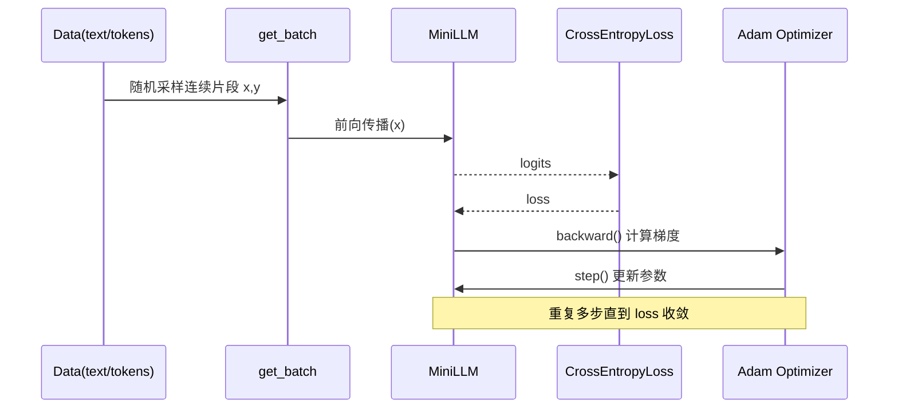

# STLLM: 从零手写极简 LLM（教学版）

这个项目的目标不是“做一个很强的大模型”，而是通过**可读、可改、可实验**的最小实现，帮助你理解 LLM 的核心机制：

- 训练数据如何变成 token
- 模型如何做下一 token 预测
- 损失如何下降
- 超参数如何影响训练与生成

当前实现是一个**字符级（character-level）**的极简 Transformer 语言模型，入口在 `main.py`，支持通过 `config.ini` 配置训练参数与语料路径。

---

## 1. 项目学习目标（和你的需求对齐）

你希望通过“自己写一个极简 LLM 工程”学习训练和调参。这个仓库按这个目标设计：

- **代码尽量短**：一个主文件就能看完主干逻辑
- **注释尽量解释为什么**：不仅告诉你“做了什么”，还告诉你“为什么这样做”
- **工程化最小闭环**：可安装依赖、可运行、可逐步扩展
- **循序渐进**：从最小可跑版本，逐步加能力（见 `TODO.md`）

---

## 2. 快速开始

### 2.1 环境准备

建议 Python 3.10+。

```bash
python -m venv .venv
source .venv/bin/activate
pip install -r requirements.txt
```

### 2.2 运行训练

```bash
python main.py
```

可选覆盖配置中的部分参数（用于快速试跑）：

```bash
python main.py --train-steps 50 --prompt "人工智能"
```

你会看到：

- 训练 step 与 loss 输出
- 训练结束后的续写生成文本

---

## 3. 当前模型结构（极简 Transformer）

当前代码按职责拆分为：

1. `model.py`：`Head`、`MultiHeadAttention`、`FeedForward`、`Block`、`MiniLLM`
2. `data.py`：语料加载与清洗、字符词表构建、batch 采样
3. `train.py`：配置读取、训练循环、生成逻辑
4. `main.py`：命令行入口

> 这是“教学最小结构”，保留了 Transformer 的关键组件，但规模很小，方便 CPU 学习。

---

## 4. 训练时序图（从数据到参数更新）



---

## 5. 为什么这样实现（关键设计原因）

- **字符级词表**：最容易上手，不依赖分词器；缺点是序列更长、语义学习更慢。
- **因果 mask**：保证第 t 个位置不能看到未来 token，符合语言模型训练规则。
- **缩放点积注意力**：用 `head_size**-0.5` 稳定数值，避免 softmax 过饱和。
- **Pre-LN 结构**：训练更稳定，尤其在层数增加时更明显。
- **FFN 模块**：注意力负责“信息路由”，FFN负责“非线性变换”，两者缺一不可。

---

## 6. 建议的学习顺序（一步一步）

### Step 1: 只跑通
- 直接运行 `python main.py`
- 观察 loss 是否下降

### Step 2: 改一个超参数只看一个现象
- 例如改 `BLOCK_SIZE`：看长程依赖能力变化
- 例如改 `EMBED_DIM`：看拟合能力与训练速度变化

### Step 3: 做对照实验（固定随机种子）
- 每次只改一个参数
- 记录最终 loss、训练时间、生成样例

### Step 4: 引入更大语料
- 使用 `sample_corpus_zh.txt` 或你自己的文本
- 注意先检查词表大小变化、数据长度变化

---

## 7. 常用可调超参数与观察点

- `EMBED_DIM`
  - 大：表示能力更强，训练更慢
  - 小：更快，但容易欠拟合

- `NUM_HEADS`
  - 多头可学习不同关系模式
  - 需满足 `EMBED_DIM % NUM_HEADS == 0`

- `NUM_LAYERS`
  - 更深通常更强，但训练更慢且可能不稳定

- `BLOCK_SIZE`
  - 更大上下文窗口，能看更长依赖
  - 计算开销升高

- `LEARNING_RATE`
  - 过大易震荡，过小收敛慢

---

## 8. 训练素材建议（标准入门）

当前仓库附带并默认使用：

- `sample_corpus_zh.txt`：中文通用训练样例（默认由 `config.ini` 中的 `corpus_path` 指向）

你也可以使用：

- [THUCNews（清洗子集）](https://github.com/thunlp/THUCNews)
- [人民日报语料（公开整理版本）](https://github.com/SophonPlus/ChineseNlpCorpus)
- [中文维基导出文本（自行清洗）](https://dumps.wikimedia.org/zhwiki/)

> 学习阶段建议先用小语料（几 KB 到几 MB），便于快速迭代。

---

## 9. 下一步可扩展方向

建议按 `TODO.md` 中的路线推进，例如：

- 加训练/验证集切分
- 加评估函数（val loss）
- 引入 temperature/top-k 采样
- 从字符级升级到子词级（BPE）
- 支持从文件加载语料

---

## 10. 免责声明

这是学习型实现，不追求工业级性能或稳定性。  
目标是帮助你理解原理和训练行为，而不是复现大规模生产模型能力。
